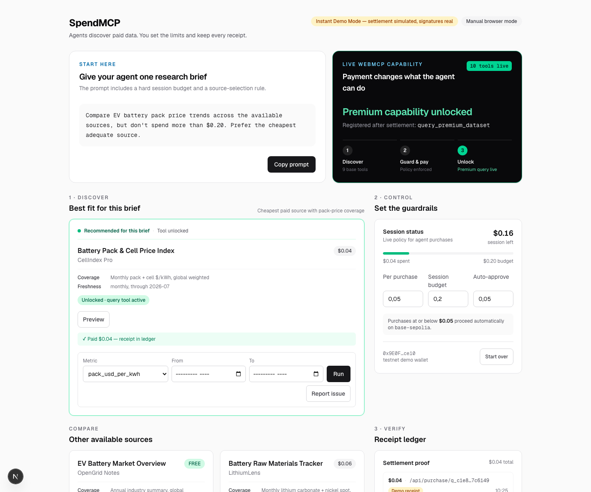
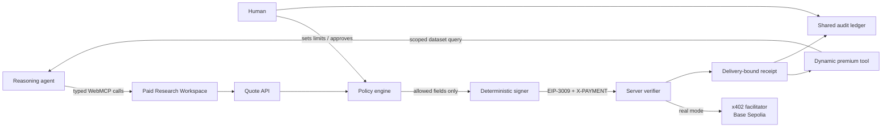

# SpendMCP — Human-Controlled Payments for Paid Web Tools

**WebMCP Challenge 2026 entry.** SpendMCP lets an AI agent discover and purchase paid web capabilities within limits set by a human, using WebMCP tools and x402 USDC payments.

[Live demo](https://spendmcp-x402.vercel.app) · [60-second judge guide](docs/judge-guide.md) · [Architecture](docs/01-ARCHITECTURE.md) · [Reproducible evidence](docs/05-IMPACT-EVIDENCE.md)



## Try it in under a minute

Open the [live workspace](https://spendmcp-x402.vercel.app) in ChatGPT's in-app browser or Chrome 149+ with WebMCP enabled, then give the agent this brief:

> Compare EV battery pack price trends across the available sources, but don't spend more than $0.20. Prefer the cheapest adequate source.

Watch the agent discover sources, preview free metadata, choose the $0.04 source, pass the spending policy, sign a payment authorization, and unlock `query_premium_dataset`. The visible capability surface changes from **9 tools to 10**, and the receipt ledger binds the payment to the delivered dataset.

Instant Demo Mode is the default: no wallet, funds, login, or API key is required. Signatures are real EIP-3009 authorizations verified server-side; settlement is simulated and clearly labeled. Real x402 Mode settles test USDC on Base Sepolia. Without a WebMCP host, the same flow remains usable through the page controls.

## The problem

Agents can research, compare, and recommend—but at a paywall they usually stop at a checkout designed for a human. Giving the model an unrestricted wallet solves the wrong problem: it removes the human from the authority boundary and makes price, recipient, replay, and prompt-injection failures financially meaningful.

Publishers face the other side of the same gap. Their paid resources are invisible to tool-using agents, so useful agent traffic reaches a dead end instead of becoming an auditable purchase.

## The solution

SpendMCP turns paid resources into browser-native, policy-bound capabilities:

1. **Discover** — the page exposes typed WebMCP tools for its paid catalog.
2. **Preview** — the agent inspects free metadata and sample rows before spending.
3. **Quote** — the server freezes resource, price, asset, recipient, network, and expiry.
4. **Check policy** — per-purchase cap, session budget, and auto-approve threshold are evaluated.
5. **Ask when necessary** — policy raises and purchases above the threshold use a shared on-page approval sheet.
6. **Pay** — a deterministic signer creates one bounded EIP-3009 authorization; the model never receives the key or chooses payment fields.
7. **Verify and deliver** — the server verifies, settles, returns a delivery-bound receipt, and dynamically registers the premium query tool.

The result is delegated commerce, not autonomous spending: the agent decides what may be useful; deterministic code decides what may be paid; the human defines and can tighten the boundary.

## Why WebMCP

This demo uses WebMCP as product infrastructure, not as a thin wrapper around `fetch`:

- the agent discovers typed tools from the page it is already visiting;
- human controls, approval state, tool state, and the agent's calls share one browser context;
- tools accept opaque catalog identifiers—not arbitrary URLs, amounts, assets, or recipients;
- a verified payment changes the live capability surface by registering `query_premium_dataset` only after settlement;
- the page still works manually when no WebMCP host is present.

That final transition is the core proof: payment does not merely return hidden JSON; it grants the agent a new, scoped capability.

## Why x402

x402 makes payment part of the HTTP resource flow. The purchase route first returns `402 Payment Required` with a quote-bound requirement. After policy approval, the client signs an EIP-3009 `TransferWithAuthorization` and retries with `X-PAYMENT`. The server independently verifies the signed fields and either settles through the facilitator or, in Instant Demo Mode, stops after verification.

Each successful response carries a receipt with the quote, payer, recipient, asset, network, nonce, idempotency key, settlement mode, and SHA-256 of the exact resource delivered. This is proof of payment **and** delivery provenance.

## Architecture



The monorepo separates the reusable payment SDK from the product demo. `packages/sdk` handles 402 detection, budgets, signing, retry, and tool registration. `apps/workspace` owns the catalog, policy UI, server verification, settlement adapter, receipts, and WebMCP lifecycle. See the [full commerce sequence and receipt schema](docs/01-ARCHITECTURE.md).

## Authority boundary

| Layer | What it controls | What it cannot do |
| --- | --- | --- |
| Reasoning agent | Source selection, preview, quote request, purchase intent | Supply price, recipient, asset, network, signature, or private key |
| Policy engine | Per-purchase cap, session budget, auto-approve threshold, allowed network/asset | Raise the human baseline through the agent path |
| On-page human | Policy raises and explicit purchase approval/denial | Silently alter a quote already issued |
| Deterministic signer | One amount/recipient/expiry-bound authorization after policy passes | Sign arbitrary model-authored payment fields |
| Server verifier | Signature, amount, recipient, window, network, nonce, quote, idempotency, settlement | Trust client policy or unlock on an unverified receipt |
| Audit ledger | Quote, approval, payment, delivery hash, settlement, issue claim | Pretend a merchant-resolved claim is an automatic refund |

The browser-generated demo key stays in local storage and is testnet-only. It is never supplied to the model or stored in an environment variable.

## Security model

| Attempted failure | Enforced result |
| --- | --- |
| Agent supplies a different price, recipient, asset, or URL | Impossible through the tool schemas; payment fields resolve server-side from an opaque quote id |
| Purchase exceeds the per-transaction or session limit | Structured refusal before signing |
| Agent tries to raise a human-set limit | On-page human approval is required |
| Same payment identifier is retried | Original receipt is returned; spend and settlement do not repeat |
| Captured payment header is replayed | Single-use nonce and consumed quote reject it |
| Signature is reused across chain or token | Server-built network domain and asset allowlist reject it |
| Quote expires or price changes after quoting | Expired/consumed quote is rejected; quoted price remains bound |
| Facilitator fails after local reservation | Quote and nonce reservations roll back; no access grant is issued |
| Tool receives malformed or extra arguments | Runtime validation returns a structured error and never throws into the host |

The complete threat model also states the residual risks: bearer payment identifiers, local-storage demo keys, in-memory server state, and demo-grade IP limits. Read [THREAT_MODEL.md](docs/THREAT_MODEL.md) and [SECURITY.md](SECURITY.md) before treating this as production payment infrastructure.

## Evaluation

Verified locally on **2026-08-28**. The repository contains **144 passing automated tests**: 48 SDK tests, 83 workspace unit/integration tests, and 13 Playwright end-to-end scenarios.

| Scenario | Expected result | Actual result |
| --- | --- | --- |
| Purchase below the $0.05 auto-approve threshold | Pay and unlock without a sheet | Pass — E2E |
| $0.12 source exceeds the default $0.05 per-purchase cap | Refuse, then require a human-approved policy raise | Pass — E2E |
| Human denies a requested purchase | Zero spend and no unlocked capability | Pass — E2E |
| Verified purchase completes | Capability surface changes from 9 to 10 tools | Pass — E2E |
| Same payment identifier is retried | Return original receipt without spending twice | Pass — E2E + unit |
| Page reloads after purchase | Policy, ledger, grant, and dynamic tool survive | Pass — E2E |
| Cross-chain or cross-token authorization is submitted | Reject before settlement | Pass — unit |
| Two requests race to consume one quote or budget | At most one succeeds; budget cannot overspend | Pass — unit |
| Settlement adapter fails | Roll back reservation and issue no grant | Pass — unit |
| Invalid WebMCP arguments are submitted | Return structured errors, never throw | Pass — E2E + unit |
| Delivery issue is reported twice | Keep one merchant-resolved claim per payment | Pass — E2E + unit |

For executable claim-to-test mapping and the public Base Sepolia transaction, see [Impact evidence](docs/05-IMPACT-EVIDENCE.md). The evidence proves implementation behavior—not publisher demand, production savings, or independent-user usability; those claims remain deliberately out of scope.

## Demo scenarios

After the golden path, try the failure states on purpose:

- **Policy refusal:** ask for the $0.12 forecast source under the default $0.05 cap.
- **Human denial:** request a policy raise, then deny it on the shared approval sheet.
- **Approval required:** set auto-approve to `$0.00`; even a $0.04 purchase must ask.
- **Retry safety:** repeat a purchase with the same payment identifier; the ledger must not increase.
- **Persistence:** refresh after purchase; the receipt and scoped query tool must return.
- **Delivery accountability:** report an issue from the unlocked source; the receipt records one merchant-resolved claim.

## Quick start

Prerequisites: Node.js 20.9+ and pnpm 10.10.0. No environment variables are required for Instant Demo Mode.

```bash
pnpm install
pnpm --filter webmcp-x402 build
pnpm -r test
pnpm --filter workspace dev
```

Open [http://localhost:3000](http://localhost:3000). To exercise the same flow with an agent, use a browser with WebMCP support; otherwise use the visible Preview and Buy controls.

### Configuration

Copy `.env.example` only when changing the defaults.

| Variable | Default | Purpose |
| --- | --- | --- |
| `MOCK_MODE` | `1` | Server: verify real signatures but simulate settlement |
| `NEXT_PUBLIC_MOCK_MODE` | `1` | Client: show the same settlement mode in badges and receipts |
| `PAY_TO` | demo placeholder | Required in real mode; recipient address you control |
| `FACILITATOR_URL` | — | Required in real mode; x402 facilitator endpoint |
| `NEXT_PUBLIC_TEST` | unset | Exposes the Playwright-only tool bridge; never enable in production |

Real mode uses Base Sepolia test USDC only. It requires `MOCK_MODE=0`, `NEXT_PUBLIC_MOCK_MODE=0`, a funded throwaway test wallet, `PAY_TO`, and `FACILITATOR_URL`.

## Reproduce the tests

```bash
pnpm --filter webmcp-x402 build
pnpm -r test                                      # 131 SDK + workspace tests
E2E_PORT=3217 pnpm --filter workspace e2e         # 13 bundled-Chromium scenarios
E2E_CHANNEL=chrome E2E_PORT=3218 \
  pnpm --filter workspace e2e                     # same scenarios in installed Chrome
```

The alternate E2E ports avoid collisions with an existing development server. Every security claim in the tables above maps to tests under `packages/sdk/test`, `apps/workspace/test`, or `apps/workspace/e2e`.

## Repository map

```text
packages/sdk/                  reusable x402 + WebMCP client primitives
  src/detect.ts               parse and validate 402 requirements
  src/budget.ts               concurrency-safe session budget
  src/pay.ts                  EIP-3009 authorization builder
  src/paidFetch.ts            402 → policy → confirm → sign → retry
  src/webmcp.ts               static/dynamic tool registration

apps/workspace/               Next.js Paid Research Workspace
  app/api/                    quote, purchase, resource, receipt, issue routes
  components/                 policy, approval, capability, source, ledger UI
  lib/tools.ts                nine static tools + scoped premium query tool
  lib/verify.ts               server-side payment verification
  lib/settle.ts               mock and facilitator settlement boundary
  test/                       workspace unit/integration tests
  e2e/                        human and agent Playwright flows

docs/                        strategy, architecture, threat model, judge assets
docs/assets/                 submission visuals
```

## Honest limitations

- Quotes, payments, nonces, claims, and the IP guard live in memory per server instance. A production deployment needs durable storage with unique constraints and transactional consumption.
- Payment and resource identifiers are bearer capabilities. They are unguessable, but a leaked identifier grants access to this synthetic demo data.
- The browser wallet is deliberately frictionless and testnet-only. A production wallet must use stronger custody and session binding.
- Delivery claims are merchant-resolved status records, not automatic refunds. Core x402 has no universal refund primitive.
- Tools register at page load. If a host injects WebMCP after load, the page needs a refresh.
- All datasets are synthetic-but-plausible. The demo proves commerce mechanics, not the accuracy of a commercial data product.

## Submission and provenance

The SDK, workspace, tests, and documentation in this repository form the WebMCP Challenge 2026 entry. The real settlement shown in the evidence document used Base Sepolia test assets with no monetary value. Third-party attribution is recorded in [NOTICE](NOTICE).

An immutable submission tag has not been cut yet; `main` is the current working submission. At the deadline, the reviewed commit should be tagged so later development cannot be confused with the judged snapshot.

## Documentation

- [Judge guide](docs/judge-guide.md) — the shortest evaluation path
- [Architecture](docs/01-ARCHITECTURE.md) — commerce sequence, components, modes, and receipt schema
- [Impact evidence](docs/05-IMPACT-EVIDENCE.md) — measured claims and public settlement proof
- [Threat model](docs/THREAT_MODEL.md) — tested attacks and accepted residual risks
- [Submission description](docs/04-SUBMISSION-DESCRIPTION.md) — Devpost-ready product narrative
- [Demo video script](docs/03-DEMO-VIDEO-SCRIPT.md) — three-minute judge story
- [Rules checklist](docs/02-RULES-CHECKLIST.md) — submission compliance

## License

Apache-2.0. See [LICENSE](LICENSE) and [NOTICE](NOTICE). The core is open source; the long-term business model is managed infrastructure around it, not gated source.
